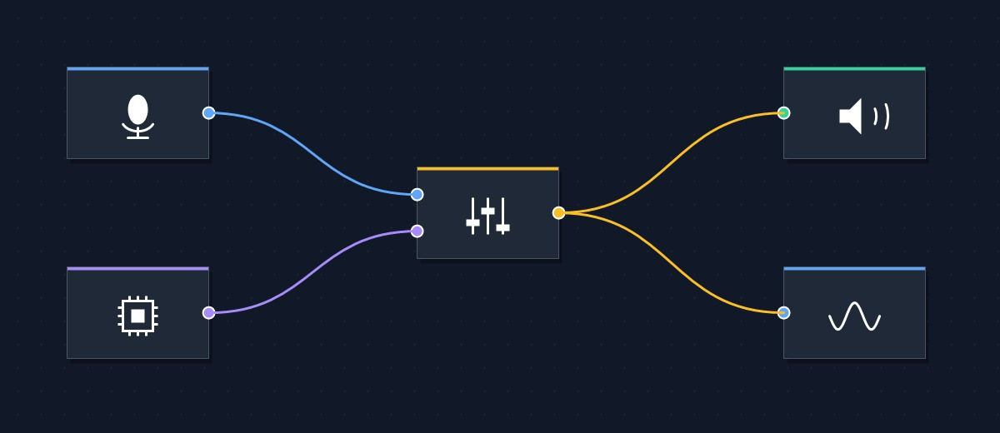

# Cable

[English README](./README.md)

<p align="center">
  
</p>

Windows용 실시간 오디오 라우팅 데스크탑 앱입니다.노드 그래프로 물리·가상 오디오 장치를 연결하고, 자체 커널 드라이버를 통해 가상 오디오 엔드포인트를 즉석에서 생성·관리할 수 있습니다.

> **Warning**
> 현재 개발 초기 단계입니다. 가상 오디오 장치 기능은 Windows 테스트 서명 모드가 활성화된 환경에서만 동작합니다.

---

## 프로젝트 개요 (Project Summary)

Cable은 시각적인 노드 그래프 위에서 어떤 오디오 소스든 어떤 싱크에든 연결할 수 있게 해 주는 Windows 라우팅 도구입니다. 기본 노드로 물리 입출력 장치(`cpal`), 자체 CableAudio 드라이버가 만드는 가상 장치, 앱 단위 루프백 캡처(WASAPI), VST3 플러그인 호스팅, 그리고 Mixer / Gain / Channel Split·Merge / Delay / Compressor / Reverb / Echo / Spectrum Analyzer / Waveform Monitor 같은 유틸리티 노드를 제공합니다.

앱은 Tauri v2 위에 만들어졌습니다. React + React Flow로 만든 프론트엔드가 위상 정렬 기반의 Rust 오디오 런타임을 구동하며, 런타임은 서브밀리초 정밀도의 스핀루프 스레드에서 그래프를 처리합니다. 프론트엔드는 모든 엣지에 대해 정적 타입 검사(채널 수 / 샘플레이트 / 비트 심도)를 수행하며, 검증을 통과한 그래프만 런타임으로 전달됩니다.

---

## 시작하기 (Getting Started)

### 릴리스 설치

1. [Releases 페이지](https://github.com/SieR-VR/cable/releases)에서 최신 `Cable_<version>_x64-setup.exe`를 내려받습니다.
2. 설치 프로그램을 실행합니다.
3. (선택, 가상 오디오 장치 사용 시) Windows 테스트 서명 모드를 활성화합니다 — [참고 사항](#참고-사항-notes) 항목 참고.
4. 시작 메뉴에서 **Cable**을 실행합니다.

처음 실행 시 Audio Input Device → Audio Output Device 두 노드가 자동으로 배치됩니다. 캔버스에서 우클릭으로 노드를 추가하고, 핸들 사이를 드래그해 연결합니다.

### 시스템 요구 사항

- Windows 10 (1809+) 또는 Windows 11
- x64 CPU
- 가상 오디오 장치를 사용하려면 테스트 서명 모드 활성화 + CableAudio 드라이버 설치

---

## 기능 (Features)

- **시각적 노드 그래프** — 드래그로 연결, 우클릭 컨텍스트 메뉴, 엣지별 타입 배지
- **물리 입출력** — `cpal`을 통해 WASAPI / DirectSound / WDM 장치 라우팅
- **가상 오디오 장치** — CableAudio 커널 드라이버로 렌더/캡처 엔드포인트를 즉석에서 생성, UAC 권한 상승을 통한 이름 변경
- **앱 단위 루프백 캡처** — 특정 프로세스의 오디오만 캡처 (Windows 10 2004+)
- **VST3 호스트** — 그래프 안에서 외부 VST3 플러그인 로드·실행
- **내장 프로세서** — Mixer, Gain, Channel Split / Merge (2 / 4 / 6 / 8 채널), Delay, Compressor, Reverb, Echo
- **시각화** — Spectrum Analyzer (FFT) · Waveform Monitor (오실로스코프)
- **정적 타입 검사** — 모든 엣지를 싱크가 기대하는 포맷과 비교, 불일치 시 강조 표시 + 런타임 적용 보류
- **저장 / 불러오기** — JSON으로 그래프 저장, 드래그&드롭으로 다시 불러오기
- **저지터 런타임** — 위상 정렬 + 스핀루프로 서브밀리초 단위 처리

---

## 참고 사항 (Notes)

- **테스트 서명 활성화.** CableAudio 커널 드라이버는 자체 생성 테스트 인증서로 서명되어 있어, 설치를 위해서는 테스트 모드를 켜야 합니다.
  ```powershell
  bcdedit /set testsigning on
  ```
  명령 후 재부팅이 필요합니다. 정식 서명된 드라이버 배포는 로드맵 항목입니다.
- **버퍼 크기.** 런타임은 장치의 네이티브 샘플레이트에서 기본 512 프레임 버퍼로 동작합니다. 버퍼를 줄이면 지연이 줄지만 그래프 부하에 따라 언더런이 발생할 수 있습니다.
- **가상 장치 이름 변경.** 가상 엔드포인트의 이름 변경은 `PKEY_Device_FriendlyName`에 직접 쓰기 때문에 관리자 권한이 필요합니다. Cable은 이름 변경 동작에 한해 자체적으로 권한 상승하여 재실행하므로, 메인 윈도우는 일반 권한으로 실행됩니다.
- **그래프 유효성 게이트.** 노드 검증이 한 곳이라도 실패하면(예: 스테레오 소스 → 모노 싱크) 런타임은 마지막으로 완전히 유효했던 그래프를 계속 실행합니다. 문제를 해결하면 새 그래프가 자동으로 푸시됩니다.
- **라이선스.** 앱 코드(`src/`, `crates/`)는 GPL-3.0, 커널 드라이버(`driver/`)는 MS-PL입니다. 드라이버는 Microsoft WDK 샘플과 [VirtualDrivers/Virtual-Audio-Driver](https://github.com/VirtualDrivers/Virtual-Audio-Driver)를 기반으로 합니다. 자세한 내용은 [LICENSE](./LICENSE) 참고.

---

## 빌드 방법 (Build Instructions)

### 사전 요구 사항

- [Rust](https://rustup.rs) (stable, `x86_64-pc-windows-msvc` 타겟)
- [Node.js](https://nodejs.org) ≥ 20
- [pnpm](https://pnpm.io) ≥ 10
- [Visual Studio Build Tools](https://visualstudio.microsoft.com/downloads/) — **C++를 사용한 데스크톱 개발** 워크로드 포함
- [Windows Driver Kit (WDK)](https://learn.microsoft.com/en-us/windows-hardware/drivers/download-the-wdk) — 드라이버를 빌드할 때만 필요

### 자주 쓰는 명령

```powershell
# JS 의존성 설치
pnpm install

# 개발 모드 (프론트엔드 HMR + Tauri)
pnpm tauri dev

# 프론트엔드만 (Rust 없이)
pnpm dev

# 프로덕션 앱 빌드
pnpm tauri build

# 한 방에 전체 빌드 (드라이버 + 프론트엔드 + Tauri 앱)
.\scripts\build.ps1

# 드라이버만 (WDK 필요)
.\scripts\build.ps1 -Target Driver

# 앱만 (드라이버 제외)
.\scripts\build.ps1 -Target App
```

### 품질 검사

```powershell
pnpm lint            # oxlint
pnpm fmt:check       # oxfmt --check
pnpm test            # Vitest (프론트엔드)
cargo test --workspace   # Rust 유닛 + ABI 테스트
cargo fmt            # rustfmt
```

### VM 기반 드라이버 테스트

드라이버 통합 테스트는 VMware 게스트 내부에서 실행됩니다. 사전 조건: VMware Workstation + PATH에 `vmrun`, `driver/x64/Debug/package/` 아래의 드라이버 빌드 산출물, 그리고 `VM_PASSWORD=...`가 정의된 `.env` 파일.

```powershell
.\.vm\setup.ps1                      # 최초 VM 프로비저닝
.\.vm\test.ps1                       # 모든 Pester 스위트 실행
.\.vm\test.ps1 -TestFilter "*IOCTL*" # Pester FullName 필터
.\.vm\exec.ps1 "Get-PnpDevice -Class MEDIA"
```

---

## 로드맵 (Roadmap)

- [ ] 정식 서명된 커널 드라이버 (테스트 서명 불필요)
- [ ] 엣지별 샘플레이트 변환 및 비트 심도 디더링
- [ ] 오디오 엣지와 별개로 MIDI 스타일 모듈레이션 그래프 (컨트롤 레이트 엣지)
- [ ] 추가 내장 프로세서: 파라메트릭 EQ, 리미터, 노이즈 게이트, 컨볼루션 리버브
- [ ] VST3 외에 LV2 / CLAP 플러그인 호스트
- [ ] 그래프별 활성/비활성을 지원하는 멀티 그래프 프로젝트 파일
- [ ] macOS 포팅 (Core Audio 백엔드, 가상 장치 지원 미정)
- [ ] 노드 단위 실시간 CPU·지연 텔레메트리
